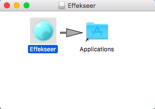
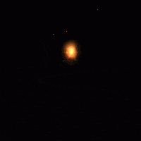

# 01.Échantillon (sample) et utilisation！

## Sommaire

Dans ce chapitre, nous ouvrirons Effekseer et examinerons les échantillons, ainsi que nous expliquerons son fonctionnement de base. Après cela, nous expliquerons comment utiliser Effekseer dans d'autres applications (par exemple, des jeux)

Effets, nous allons créer ce chapitre.

## Démarrage

### Effekseer méthode de démarrage (Windows)

Effekseer est situé dans "Tool/Effekseer.exe". Accédez au dossier et double-cliquez sur l'exécutable pour démarrer le programme.

Effekseer Icon

### Si Effekseer ne démarre pas (Windows)

#### OS est trop vieux.

Effekseer peut fonctionner sur Windows 7 SP1 ou version supérieure. 

#### Vérifiez que D3DCompiler_47.dll est installé

Téléchargez-les à partir des liens ci-dessous.

<ul>
<li><a href="https://support.microsoft.com/en-us/help/4020302/the-net-framework-4-7-installation-is-blocked-on-windows-7-windows-ser" target="_top">D3DCompiler_47.dll</a></li>
</ul>

#### Exécuter Effekseer directement à partir du fichier .zip 

Extrayez les fichiers avant d'exécuter. Cliquez avec le bouton droit sur le .zip et sélectionnez "Extraire tout" dans le menu contextuel.

#### Effekseer ne démarre toujours pas

Veuillez nous contacter sur le site officiel.

### Méthode de démarrage Effekseer (Mac)

Effekseer se trouve dans "Effekseer.dmg". Déplacez Effekseer vers un autre dossier tel que Applications et double-cliquez sur l'exécutable pour démarrer le programme.

### Si Effekseer ne démarre pas (Mac)

#### OS est trop vieux.

Effekseer peut fonctionner sur macOS Sierra ou version supérieure.

#### Exécuter Effekseer directement depuis dmg

Effekseer vers un autre dossier.

#### Effekseer ne démarre toujours pas

Veuillez nous contacter sur le site officiel.

### Démarrage réussi

Si le démarrage réussit, vous serez accueilli par un écran similaire à celui-ci.

Écran de démarrage d'Effekseer

Essayons maintenant d'ouvrir un échantillon(sample).

## Ouverture d'un échantillon et opération de base

Après le démarrage, vous verrez un écran 3D avec rien affiché dessus. Appuyez sur le bouton de lecture situé en bas à gauche.

Play Button

Après avoir appuyé sur le bouton de lecture, vous verrez un carré blanc. Ce carré blanc est la <b> particule </b> dont sont composés les effets. Les effets sont généralement constitués de nombreuses <b> particules </b>. Puisqu'aucun paramètre n'a été défini, tout ce qui est visible est une seule particule carrée blanche. Des particules comme celles-ci sont à la base de tous les différents effets de particules qui peuvent être créés à l'aide de ce logiciel, mais pour les nouveaux utilisateurs, l'édition de particules en particules copmlex peut être difficile. Pour cette raison, nous ne traiterons pas de l'édition des particules dans ce chapitre.

Square particle

Faire des particules uniquement en utilisant des carrés blancs n'est cependant pas amusant. Pour résoudre ce problème, nous allons télécharger un exemple de fichier. Veuillez télécharger l'exemple à partir du lien ci-dessous et l'extraire.

<a href = "../../Sample/01_Sample.zip">Download</a>

Après avoir extrait l'exemple, recherchez le fichier "Sample.efkproj" et extrayez-le. Vous pouvez l'ouvrir en double-cliquant sur le fichier ou en faisant glisser le projet ou en le faisant glisser sur l'écran 3D d'Effekseer. Après avoir ouvert le fichier, appuyez sur le bouton de lecture. Vous devriez voir ce qui suit.

Sample project. 

En plus de cet échantillon, il existe plus de 150 échantillons disponibles gratuitement sur le site officiel. Veuillez consulter le lien ci-dessous pour plus de détails.

<a href = "https://effekseer.github.io/jp/contribute.html">Official website</a>

Jusqu'à présent, nous avons examiné une direction fixe, alors déplaçons la fenêtre. Vous trouverez ci-dessous des instructions sur la façon de procéder.

<table border="1">
<tr>
<td>Rotation</td>
<td>Cliquez sur le bouton droit de la souris et déplacez la souris tout en maintenant la touche enfoncée.</td>
</tr>
<tr>
<td>Pan</td>
<td>Cliquez sur le bouton central de la souris ou sur le bouton droit + Maj et déplacez la souris tout en maintenant la touche enfoncée.</td>
</tr>
<tr>
<td>Zoom</td>
<td>Faites défiler la molette de la souris ou le bouton droit + Contrôle pour effectuer un zoom avant et arrière.</td>
</tr>
</table>

Utilisez la souris pour regarder la particule échantillon précédente dans une direction différente

Échantillon sous une nouvelle perspective

Afin de rendre les effets d'édition plus faciles, les effets seront bouclés par défaut. Vous pouvez spécifier une plage à boucler en utilisant la zone de texte en bas à gauche (illustrée ci-dessous) 。Effekseer avance par incréments de <b> 1 / 60e seconde </b> 。Pour cette raison, la plage par défaut est définie entre 0 et 2 secondes.

Loop range

## Utilisation externe

Si vous ne vous souciez que de la création d'effets, vous n'avez pas besoin de lire cette section. Cependant, les effets sont généralement exportés et utilisés dans d'autres applications. Cette section explique deux méthodes d'utilisation des fichiers Effekseer dans des applications externes.

### Recording

Effekseer vous permet de produire des feuilles de sprite et des animations gif de vos effets enregistrés à intervalles réguliers. Lorsque "Window ->Record" est sélectionné dans la barre de menu, "Recording Window" est affiché. Ici, vous pouvez modifier les paramètres d'enregistrement tels que la taille ou la fréquence d'enregistrement des images pour vos feuilles de sprite ou vos gifs.

Recording Window

Effekseer vous permet de produire des feuilles de sprite et des fichiers vidéo dans lesquels les images sont affichées à des intervalles de temps réguliers. Une feuille de sprite est un fichier image unique dans lequel toutes les images d'une animation sont organisées dans l'ordre.

Après avoir réglé les paramètres et appuyé sur "Record", une boîte de dialogue s'affiche pour vous demander de sauvegarder les résultats enregistrés. Lorsque vous appuyez sur Enregistrer dans la boîte de dialogue, les résultats enregistrés à la destination spécifiée sont enregistrés.

Étant donné que la feuille de sprite en sortie n'est qu'une image, elle peut être facilement utilisée par d'autres applications. Les fichiers vidéo peuvent également être utilisés avec un logiciel de montage vidéo tel que AfterEffects.

Un exemple de feuille de sprites

### Pour Unity, Unreal Engine 4 et ainsi de suite

Le fichier efkefc des effets Effekseer peut être chargé par des moteurs de jeu tels que Unity, UnrealEngine4 et Cocos2d-x.

Il est également possible d'incorporer Effekseer dans votre projet en utilisant le runtime Effekseer. (Pour plus d'informations, veuillez consulter le développeur.)

Exemple d'utilisation dans Unity

## À propos des exemples d'effets 

Le site officiel d'Efekseer propose de nombreux exemples d'effets. Ceux-ci peuvent être utilisés sans aucune restriction. Vous pouvez les utiliser tels quels pour un film ou un jeu, ou comme base pour de nouveaux matériaux que vous créez vous-même. Le ciel est la limite!

Sample Collection 

        
Ce n'est pas obligatoire, mais il serait apprécié que vous incluiez le nom de l'auteur qui a créé les exemples d'effets que vous utilisez.

Vous pouvez également utiliser des exemples d'effets comme des idées de référence sur la manière de créer vos propres effets. Il peut être difficile pour un débutant de comprendre comment un certain effet a été produit, mais dans le chapitre suivant, nous verrons comment créer des effets pour vous donner une meilleure idée de ce qu'il faut rechercher dans ces exemples de fichiers.

## Sommaire

Dans ce chapitre, nous avons exploré l'utilisation de base d'Effekseer et les bases de la lecture d'effets dans des applications externes. Dans le chapitre suivant, nous verrons comment créer nos propres effets.

