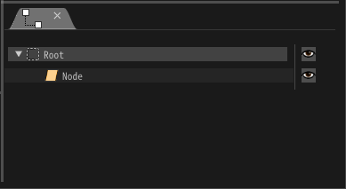
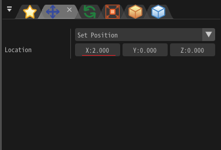
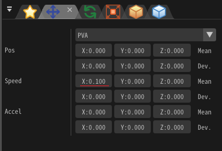
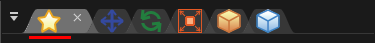
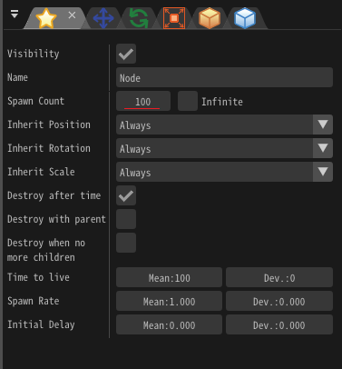
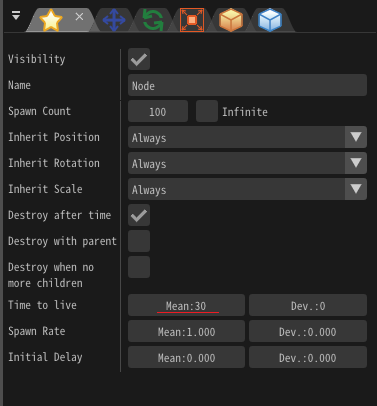

# 02.Répandons les particules!

<div class="main">

## Aperçu

Dans ce chapitre, vous disperserez les particules. <>
Ce chapitre ne suffit pas pour créer des effets sympas, mais vous pouvez apprendre le fonctionnement de base d'Effekseer.
Sur la base des connaissances acquises dans ce chapitre, vous créerez un effet sympa dans le chapitre suivant.
Par conséquent, comprenons fermement.


<iframe src='../../Sample/viewer_en.html#02_Sample/effect.efk'></iframe>

## Modifier l'emplacement
   
### Modifier l'emplacement initial

Actuellement, les particules sont affichées au centre. Déplaçons cette particule du centre.

<div align="center">

<p>Montré au centre</p>
</div>

Tout d'abord, cliquez sur "Node" dans le "Node Tree" sur le côté droit de l'écran. Le "Node Tree" window est
Il montre la structure de l'ensemble de l'effet, "Node" indique des particules. En modifiant cela, vous pouvez modifier la forme de cette particule.

<div align="center">

<p>Node Tree Window</p>
</div>

Lorsque vous cliquez dessus, un grand nombre de paramètres disponibles seront affichés.
Bien qu'il puisse être surpris que ce soit la première fois, seule une partie des paramètres est utilisée dans ce chapitre.

Pour modifier la position de l'emplacement initial, modifiez les paramètres de la fenetre "Position".

Cliquez sur une icône de "Position" fenêtre affichée dans un onglet en haut à droite pour afficher la fenetre "Position".

<div align="center">

<p>Une icône de la fenêtre de position</p>
</div>

<div align="center">

<p>Position Window</p>
</div>

Modifions la valeur de x à la position dans la fenêtre de position de 0 à 2.

Une valeur peut être saisie à partir du clavier en cliquant avec le bouton gauche de la souris sur une zone de saisie de texte.

Cliquez avec le bouton gauche et faites glisser une zone de saisie de texte pour modifier la valeur progressivement.

```eval_rst
.. image:: ../../img/Reference/Overview/input_value.png
   :align: center
```

<div align="center">

<p>Changer la valeur de x</p>
</div>

Ensuite, la particule s'est déplacée du centre vers l'extérieur.

<div align="center">

<p>Déplacez-vous vers l'extérieur</p>
</div>

### Faire bouger la particule

Ce n'est pas amusant quand la particule est gelée. Déplaçons la particule.

Effekseer a plusieurs façons de spécifier la position.

Bien que la position soit fixe dans le réglage initial, il existe une méthode de spécification qui peut spécifier la vitesse et l'accélération.

Cliquez sur la liste déroulante dans la fenêtre "Position" et passez de position en position, vitesse, accélération.
Ensuite, une zone de texte pour entrer la vitesse et l'accélération est ajoutée à la fenêtre "Position".
Vous serez en mesure de définir la vitesse et l'accélération des particules afin de pouvoir déplacer les particules.

<div align="center">

<p>Position, Velocity, Accelaration</p>
</div>

Entrons 0,1 dans la direction x vitesse (moyenne).

<div align="center">

<p>Position, Velocity, acceleration</p>
</div>

Ensuite, la particule a commencé à sauter hors de l'écran.

<div align="center">

<p>Moving effect</p>
</div>

Essayons de voir comment le comportement change en entrant d'autres nombres.

### Afficher plusieurs particules

Il y a peu d'effets construits à partir d'une seule particule.
Montrons plusieurs particules.

Le nombre de particules est défini sur le nombre d'apparitions dans la fenêtre "Basic Settings".
L'augmentation de ce nombre générera beaucoup de particules. 


Cliquez sur une icône de la fenêtre "Basic Settings"  pour afficher la fenêtre "Basic Settings".

<div align="center">

<p>An icon of Basic Settings</p>
</div>

<div align="center">

<p>Spawn Count</p>
</div>

Mettez le spawn count 100.

<div align="center">

<p>Ajouter spawn count</p>
</div>

De nombreuses particules sont désormais générées.
Cependant, comme toutes les particules se déplacent dans la même direction, les particules seront affichées en chevauchement.

<div align="center">

<p>Add spawn count</p>
</div>

### Se déplacer au hasard pour chaque particule

Lorsque la direction du mouvement des particules est la même, les particules seront affichées en chevauchement.
Alors, déplaçons au hasard pour chaque particule.

Entrons 0,1 pour l'écart xyz de la vitesse. De plus, nous avons réinitialisé 0,1 qui était entré pour signifier plus tôt à 0.

Cela signifie que la vitesse est réglée aléatoirement entre -0,1 et 0,1.
Autrement dit, les particules se déplacent sur toute la périphérie autour de (0, 0, 0).

<div align="center">

<p>Random</p>
</div>

Les particules se déplacent maintenant sur toute la circonférence.

<div align="center">

<p>Random</p>
</div>

### Raccourcir la durée d'affichage des particules

Bien que les particules soient affichées depuis longtemps maintenant, certains effets sont affichés pendant une courte période, en fonction de l'effet.
Raccourcissons le temps d'affichage.

Il existe un paramètre appelé Time to live dans la fenêtre commune.
Raccourcissons ce paramètre. Je suis entré 30 cette fois.

<div align="center">

<p>Temps de vivre</p>
</div>

Si vous le réduisez, les particules disparaîtront bientôt.

<div align="center">

<p>Temps de vivre</p>
</div>

Enfin, j'ai rendu possible le téléchargement de l'effet créé dans ce chapitre.

<div align="center">
<a href = "../../Sample/02_Sample.zip">Download</a>
</div>

## Sommaire

Cette fois, j'ai créé plusieurs particules et j'ai fait bouger.
Dans le chapitre suivant, vous éditerez à partir d'une particule pour ressembler davantage à un effet.

</div>
