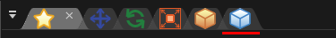
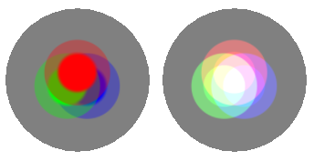

# 03. Montrons l'image!

<div class="main">

## Aperçu
Dans ce chapitre, les images sont affichées sur des particules.
Jusqu'à présent, c'était un carré blanc, mais le carré blanc se transforme en image.
De plus, nous allons progressivement rendre les particules transparentes et changer de couleur.

<iframe src='../../Sample/viewer_en.html#03_02_Sample/effect.efk'></iframe>

## Connaissances préliminaires - Lorsque la fenêtre est fermée, la disposition des fenêtres est incorrecte

Si vous changez de fenêtre, le placement peut devenir étrange ou il peut se fermer.
Dans ce cas, sélectionnez "Window" dans la barre de menus.
Quand "Reset Window Position" est sélectionné, la position de chaque fenêtre est ramenée à la position initiale.
Si vous sélectionnez le nom de chaque fenêtre, vous pouvez ouvrir cette fenêtre.

## Afficher l'image

Il est difficile de préparer les images vous-même, nous pouvons donc télécharger les effets pré-créés à partir du lien ci-dessous.

<div align="center">
<a href = "../../Sample/03_01_Sample.zip">Download</a>
</div>

### Paramètres d'image

Définissons l'image sur le carré blanc immédiatement.
L'image est définie à partir de la fenêtre "Basic Render Settings".
Cliquez sur l'icône de "Basic Render Settings" sur l'onglet en haut à droite.

<div align="center">

<p>Une icône des paramètres de rendu de base</p>
</div>

Cliquez sur l'icône de "Basic Render Settings" puis cliquez sur le nœud, la fenêtre "Basic Render Settings" sera affiché.

<div align="center">

<p>"Basic Render Settings" window</p>
</div>

Cliquez sur le bouton Charger dans l'image de la fenêtre "Basic Render Settings".
Lorsque vous cliquez dessus, une fenêtre de sélection de l'image s'affiche.
Sélectionner particle.png.
Lorsque vous sélectionnez une image, l'image sera également affichée sur Effekseer.

<div align="center">

<p>Image</p>
</div>

Lorsque vous jouez l'effet, vous pouvez voir que le carré blanc est devenu une image.

<div align="center">

<p>Image</p>
</div>

### Paramètres de fondu entrant et sortant

Il n'est pas naturel que des particules apparaissent soudainement ou disparaissent.
Définissons les fondus entrants et sortants pour que la transparence change.

Le fondu entrant peut être défini en modifiant la valeur du fondu entrant dans la fenêtre "Basic Render Settings".
De même, le fondu de sortie peut être défini en modifiant la valeur du fondu de sortie dans la fenêtre "Basic Render Settings".
Nous entrerons 15 pour les deux cette fois.

<div align="center">

<p>Fade</p>
</div>

Vous pouvez voir que l'effet apparaît et disparaît progressivement.

<div align="center">

<p>Fade</p>
</div>

### Sprite

Effekseer a plusieurs méthodes de dessin.
La méthode par défaut est "Sprite". Vous pouvez dessiner des particules rectangulaires.
Bien que cela ne soit difficile que par le contenu décrit dans ce chapitre, vous pouvez créer un tel effet.

<div align="center">

<p>Sprite</p>
</div>

Dans la fenêtre "Render Settings", vous pouvez définir les fonctions spécifiques à la méthode de dessin actuellement sélectionnée.
Montrons la fenêtre "Render Settings" comme il a affiché la fenêtre "Basic Render Settings".

<div align="center">

<p>An icon of Render Settings</p>
</div>

<div align="center">

<p>"Render Settings" window</p>
</div>

#### Paramètres de couleur

Vous avez défini la transparence avec un fondu, mais vous ne pouvez pas définir la couleur des particules.
Bien qu'il n'y ait aucun problème si l'image est colorée, vous devrez préparer plusieurs images pour changer la couleur de chaque particule.
Par conséquent, vous pouvez spécifier une tendance approximative de la couleur des particules si un sprite est sélectionné.

Vous pouvez spécifier cette couleur dans la fenêtre "Render Settings". Il existe plusieurs méthodes pour spécifier les couleurs.
Pour cette fois, vous choisissez aléatoire car la couleur change pour chaque particule.
Ensuite, vous définissez le minimum de la valeur sur 0. Cela signifie que les valeurs sont choisies au hasard entre 0 et 255 couleurs.

En plus de la zone de texte, la couleur peut être saisie en cliquant avec le bouton gauche de la souris sur le champ de couleur.

```eval_rst
.. image:: ../../img/Reference/Overview/input_color_basic.png
   :align: center
```

Cliquez avec le bouton gauche et faites glisser un champ de couleur pour copier la valeur dans un autre champ de couleur.

```eval_rst
.. image:: ../../img/Reference/Overview/input_color.png
   :align: center
```

<div align="center">

<p>Specifiy a color</p>
</div>

Vous pouvez voir que la couleur est différente pour chaque particule.

<div align="center">

<p>Specifiy a color</p>
</div>

### Paramètres de fusion

Effekseer vous permet de définir la méthode de mélange alpha des particules.
Blend est une méthode de combinaison de particules et d'arrière-plan.
Comme le montre la figure ci-dessous, vous pouvez simplement dessiner des particules ou les ajouter à l'arrière-plan.

<div align="center">

<p>Blend mode</p>
</div>

Pour cette fois, vous définissez la méthode de fusion à ajouter pour éclaircir les particules.
Vous pouvez définir la méthode de fusion dans la fenêtre "Basic Render Settings".

<div align="center">

<p>Blend mode</p>
</div>

Si vous ajoutez la méthode de fusion, vous pouvez voir que les particules sont affichées brillantes.

<div align="center">

<p>Specify blend</p>
</div>

Enfin, j'ai rendu possible le téléchargement de l'effet créé dans ce chapitre.

<div align="center">
<a href = "../../Sample/03_02_Sample.zip">Download</a>
</div>

## Sommaire

Dans ce chapitre, nous avons modifié les paramètres du sprite pour améliorer l'apparence des particules.
Dans le chapitre suivant, nous expliquerons la forme des sprites, la rotation et l'agrandissement des particules.

</div>
