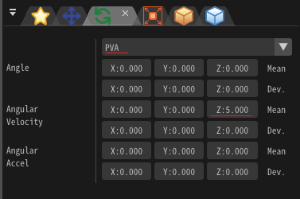
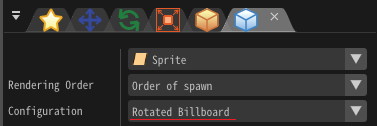
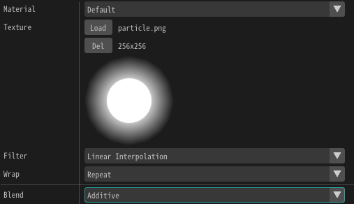

# 04. Tournons et agrandissons!

<div class="main">

## Aperçu
Dans ce chapitre, nous faisons pivoter et agrandir les particules.
Nous changeons également la forme du sprite d'un carré à un rectangle.
Cela permet de créer des effets compliqués.

<iframe src='../../Sample/viewer_en.html#04_02_Sample/effect.efk'></iframe>

## Rotation et expansion

Nous avons rendu possible le téléchargement de l'effet créé à l'avance à partir du lien ci-dessous.

<div align="center">
<a href = "../../Sample/04_01_Sample.zip">Download</a>
</div>

### Rotation

Let's rotate the particles immediately.
Faisons tourner les particules immédiatement.
La rotation peut être spécifiée à partir de la fenêtre "Rotation".

Cliquez sur une icône de la fenêtre "Rotation" pour afficher la fenêtre "Rotation".

<div align="center">

<p>An icon of Rotation window</p>
</div>

<div align="center">

<p>"Rotation" window</p>
</div>

Tout comme la position, il existe plusieurs façons de spécifier la rotation.
Par défaut, ```Fixed angle``` est sélectionné.
Remplacez ceci par ```PVA```.
Entrez ensuite 5 pour ```Angular Velocity``` z.

Cela signifie que vous faites pivoter de 5 degrés par image autour de la direction Z (direction avant) comme axe.


<div align="center">

<p>Angular velocity</p>
</div>


Après la saisie, vous jouez l'effet ... rien ne change!
En effet, dans le réglage initial du dessin par sprite, le sprite fait toujours face à l'avant même si la particule tourne.

Dans la fenêtre "Render Settings", changer la ```Configuration``` de ```Billboard``` à ```Rotated Billboard```.
```Rotated Billboard``` est une méthode de mise en page dans laquelle la forme rectangulaire fait face à l'avant tandis que la rotation de l'axe Z est activée.

<div align="center">

<p>Configuration</p>
</div>

Lors du réglage du ```Rotated Billboard```, vous pouvez voir que le rectangle tourne autour de la direction Z (direction avant).

<div align="center">

<p>Rotation</p>
</div>


### Scale

Comme pour la position et la rotation, vous pouvez mettre à l'échelle les particules.
You can specify scale from the "Sale" window.

Vous pouvez spécifier l'échelle à partir de la fenêtre "Scale".

<div align="center">

<p>An icon of Scale window</p>
</div>

<div align="center">

<p>"Scale" window</p>
</div>

Tout comme la position et la rotation, il existe également un moyen d'en spécifier plusieurs dans l'échelle.
Dans le réglage initial, le ```Fixed Scale``` est sélectionné.
Remplacez ceci par ```PVA(Single)```.
Saisissez ensuite 0,01 pour ```Expansion Speed```.

```Expansion Speed``` peut également être réglé individuellement dans les directions X, Y, Z, mais ```Expansion Speed``` est souvent le même dans toutes les directions.
Par conséquent, vous pouvez définir un ```Expansion Speed```.

<div align="center">

<p>Expansion Speed</p>
</div>

Vous pouvez voir que le sprite tourne et s'agrandit.

<div align="center">

<p>Scale</p>
</div>

## Sprite shape

La forme du sprite peut être changée de carré en rectangle, trapèze, etc.

Changez ```Vertex Coords``` de la fenêtre "Render Settings", de ```Default``` à ```Fixed```.
Ensuite, vous pouvez spécifier les coordonnées des sommets du sprite.

Pour cette fois, saisissons comme suit pour agrandir le sprite verticalement.

<div align="center">

<p>Vertex Coords</p>
</div>

Vous pouvez voir que la longueur verticale du sprite est plus longue que la longueur horizontale de un.

<div align="center">

<p>Vertex Coords</p>
</div>

## Finish

Puisqu'il n'est pas beau tel quel, vous modifiez les paramètres comme suit.

### La fenêtre "Basic Settings"

Changez ```Spawn Count``` à 10

<div align="center">

</div>

### La fenêtre "Position"

Changer en PVA

Changer Pos deviation en 2

<div align="center">

</div>

### La fenêtre "Basic Render Settings" 

Sélectionnez ```Texture``` dans particle.png

Changer  ```Blend``` en ```Additive```

<div align="center">

</div>

### La fenêtre "Rotation"

Changer la dérivation de l'angle Z en 180

<div align="center">

</div>

### La fenêtre "Scale"

Changer ```Scaling Factor``` en 0

<div align="center">

</div>

### Résultat

Si vous ne savez pas comment modifier ces paramètres, veuillez consulter les chapitres 1 à 3.

<div align="center">

<p>Result</p>
</div>

Enfin, j'ai rendu possible le téléchargement de l'effet créé dans ce chapitre.

<div align="center">
<a href = "../../Sample/04_02_Sample.zip">Download</a>
</div>

## Sommaire

Dans ce chapitre, nous avons expliqué la rotation et l'agrandissement des sprites.
Dans le prochain chapitre, nous créerons des effets pratiques en tirant le meilleur parti de nos connaissances.
</div>
